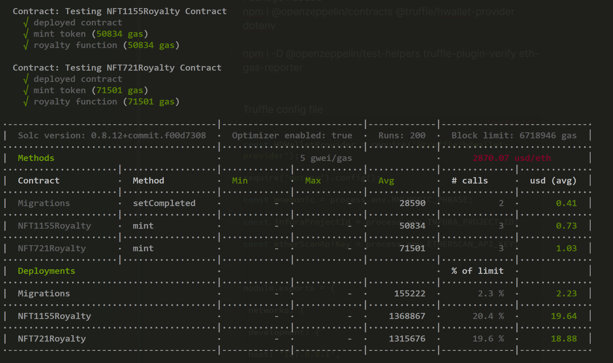

### ERC 721/1155(token) + ERC2981(royalty)

Notes:
After adding this loyalty feature, does that mean that in every transaction, owner/artist will receive the royalty?
The answer is no, whether you will receive the royalty or not is `highly depend on the nft marketplace`.

`ERC-2981 only specifies a way to signal royalty information and does not enforce its payment. See Rationale in the EIP. Marketplaces are expected to voluntarily pay royalties together with sales, but note that this standard is not yet widely supported.`

### Result

Reference
https://docs.openzeppelin.com/contracts/4.x/api/token/common
https://eips.ethereum.org/EIPS/eip-2981
